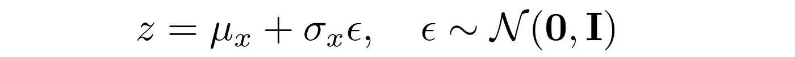

# lab notebook
## 1/8
- reading Li 2023 (KPGT) and Tong 2024 (TranSiGen) from [papers](/papers)
- learn about RNNs and GNNs, compare to CNNs
- learn about VAEs (variational autoencoders)
- KPGT:
    - addition of a knowledge node (K node), using a LiGhT transformer model, and path-finding and distance modules to incorporate as much chemical information as possible from the given molecules

## 1/13
- TranSiGen:
    - what does SOTA mean for Fig 3b? if it performs like in the middle of all of the other tested models
    - where does the pre-training representation fit into the rest of the whole pipeline?
    - PCC = Pearson's correlation coefficient
- AUC: area under the dose-response curve from cancer treatment response portal (CTRP) for evaluating different drugs
- what does IC50 less than 10 uM mean for a drug "hit"?
- "curse of dimensionality" lol
- chatting with Nikos enlightened me to the fact that a lot of the statistics that were reported in benchmarking were not really all that good compared to the other models they tested against, especially using a two-sided t test for a dataset containing 3 points instead of a wilcoxon test for Fig 3b. also, we don't know what the gray dots are there. the KPGT vs ECFP4 do not perform all that differently either.
- the ligand-based virtual screening and drug repurposing are actually pretty good though and I need to reread to understand better.
- next steps: read through their model.py and understand how an architecture like that is made!
- sources:
    - [KL Divergence](https://dibyaghosh.com/blog/probability/kldivergence.html)
    - [Curse of Dimensionality](https://www.geeksforgeeks.org/curse-of-dimensionality-in-machine-learning/)
    - [VAEs vs AEs](https://towardsdatascience.com/difference-between-autoencoder-ae-and-variational-autoencoder-vae-ed7be1c038f2)

### Variational AutoEncoders (VAEs)
- Autoencoders (AEs) map input to a latent space, where picking a random latent variable in that space will generate "garbage output" and may not be a valid output -- it lacks the generative capability. however, mainly used for compression. non-linearity makes it more powerful for compression than PCA.
- VAE address the issue of non-regularized latent space. it provides the generative capability to the entire space.
    - VAE encoder, instead of outputting vectors in latent space, outputs parameters of a pre-defined distribution in the latent space for every input.
    - this latent distribution is constrained to be a normal distribution
    - latent vector is randomly sampled from the mean and STD for each input
        - makes it difficult for backpropagation to happen for encoder
        - instead, use a reparameterization trick to model the sampling process to allow errors to propagate through the network
        
- VAE has two objectives:
    - reconstruct the input (reconstruction loss)
        - mean squared loss of the input and reconstructed output, just like loss for AEs
    - latent space should be normally distributed (similarity loss)
        - KL divergence between latent space distribution and standard Gaussian (mean = 0, variance = I)
            - unit norm condition makes sure the latent space is evenly spread out and does not have significant gaps between clusters
- VAE loss function: similarity loss + reconstruction loss
- can interpret hidden latent variables using perturbation

### Curse of Dimensionality
- efficiency and effectiveness of algorithms deteriorate as the dimensionality of the data increases
- meaningful patterns are difficult to discern if data points are sparse
- ML algos running on high-D data -> increased computational complexity, more compute needed, greater risk of overfitting

### AUC/ROC
- the higher the AUC, the better the model is distinguishing between the different classes (ranges between 0 and 1, where 0.5 means model has no class separation capacity whatsoever)


## 1/14
### PyTorch tutorials from 6.S191
- nn.Module and nn.Sequential are slightly different, but Sequential is a subclass of Module. the following two code blocks produce the same effect:
```
class NN(nn.Module):
    def __init__(self):
        super().__init__()

        self.fc1 = nn.Linear(10, 4)
        self.fc2 = nn.Linear(4, 2)

    def forward(self, x)
        x = F.relu(self.fc1(x))
        x = F.relu(self.fc2(x))
        return x
```
```
NN = Sequential(
    nn.Linear(10, 4),
    nn.ReLU(),
    nn.Linear(4, 2),
    nn.ReLU()
)
```
- when creating a neural netword, you define your layers in the __init__ block and specify how they should be acted on in forward.
- however, if the model you're defining is sequential, then you can simply use a nn.Sequential. the forward function is implicitly known because the layers are sequentially called on the outputs.
- for a CNN classifier, you might do one nn.Sequential for the CNN part, and another nn.Sequential for the fully connected classifier.

### 6.S191 Lab 1B
- when creating an LSTM model, may want to set nn.LSTM(..., batch_first=True)
- nn.LSTM expects an input shape of (seq_length, batch_size, input_size). However, nn.Embedding outputs (batch_size, seq_length, embedding_dim). by setting batch_first=True, the LSTM expects inputs in (batch_size, seq_length, input_size) format.

### 6.S191 Lab 3
- fine-tuning: adapt a pre-trained neural network to better suit a downstream task, domain, or style, by training the model further on new data. for language-modeling, can be used to:
    - adapt the model's writing style, teach model new capabilities, reduce biases

### TranSiGen
- the vae_x1.py and vae_x2.py files are essentially just the modular parts of the model.py. but the model.py is pretty straightforward
- want to try and create my own model first, and then using the notebook you can manipulate it and train it how you want
- next steps: design a model architecture to predict MAS and Fibrosis scores from chemical structures of drugs
- try to create a template in a .py file